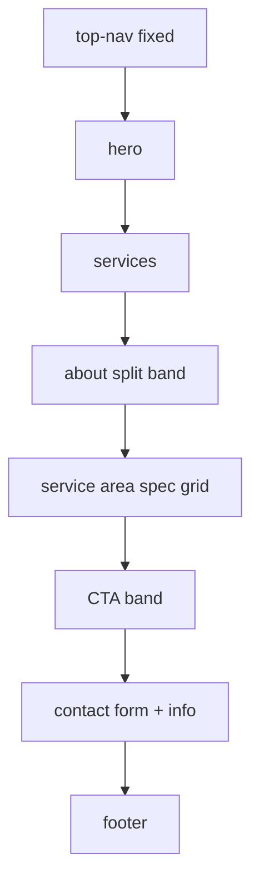

<!-- PRESERVATION RULE: Never delete or replace content. Append or annotate only. -->

# Architecture

Static single-page site. No build pipeline, no framework, no server required for preview.

## File map

```
lorenz-plumbing-solutions/
├── index.html          # Page structure + content
├── styles.css          # Design tokens + layout + components
├── script.js           # Client interactions
├── bugatti/
│   └── DESIGN.md       # Reference design system (not loaded at runtime)
├── DOCS/               # Project documentation
└── README.md           # User-facing quick start
```

## Page flow



## Design token flow

CSS custom properties in `:root` (`styles.css`) mirror Bugatti tokens from `bugatti/DESIGN.md`:

- **Colors** → `--canvas`, `--ink`, `--body`, `--muted`, `--hairline`, `--link`
- **Typography** → `--display`, `--text`, `--mono` font stacks
- **Spacing** → `--xs` through `--section` (4px base, 120px section rhythm)

## JavaScript scope

| Module | Responsibility |
|---|---|
| Nav toggle | Opens/closes `#navDrawer`, updates ARIA |
| Contact form | Validates required fields, builds `mailto:` URL |
| Year | Sets `#year` in footer copyright |

No external JS libraries.

## Deployment options

- **Static host:** Netlify, Vercel, GitHub Pages, S3 — deploy repo root as-is
- **Local:** Open `index.html` directly (fonts still load from Google CDN)

## Future extensions (not implemented)

- Form backend endpoint
- Hero / service photography assets in `/assets/`
- Optional `favicon.ico` + Open Graph meta tags
