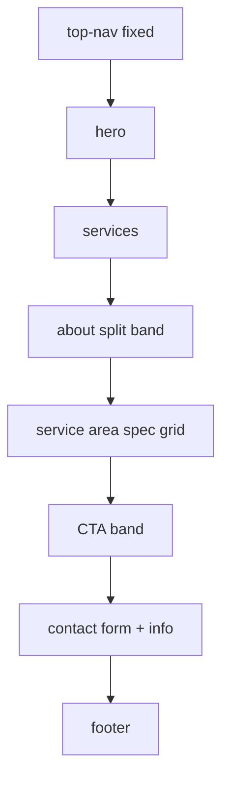
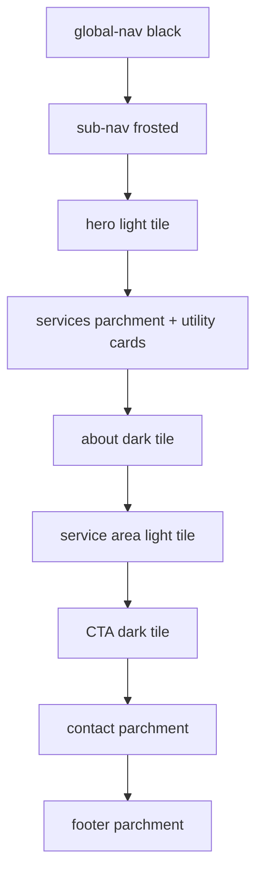

<!-- PRESERVATION RULE: Never delete or replace content. Append or annotate only. -->

# Architecture

Static multi-design site. No build pipeline, no framework, no server required for preview. Each design is a fully separate page with its own CSS/JS.

## File map

```
lorenz-plumbing-solutions/
├── index.html              # Bugatti design (default)
├── styles.css              # Bugatti tokens + layout
├── script.js               # Bugatti interactions
├── apple.html              # Apple design variant
├── styles-apple.css        # Apple tokens + layout
├── script-apple.js         # Apple interactions
├── billboard.html          # Billboard design variant
├── styles-billboard.css    # Full-viewport signage layout
├── script-billboard.js     # Billboard interactions
├── stripe.html             # Stripe design variant
├── styles-stripe.css         # Gradient mesh + indigo system
├── script-stripe.js          # Stripe interactions
├── design-switcher.css     # Shared theme cycle button
├── design-switcher.js      # Cycles Bugatti → Apple → Billboard → Stripe → …
├── bugatti/
│   └── DESIGN.md           # Bugatti reference (not runtime)
├── DOCS/
│   └── awesome-design-md/
│       └── design-md/apple/DESIGN.md   # Apple reference
└── README.md
```

## Multi-design pattern

| Design | HTML | CSS | JS | Reference |
|---|---|---|---|---|
| Bugatti (default) | `index.html` | `styles.css` | `script.js` | `bugatti/DESIGN.md` |
| Apple | `apple.html` | `styles-apple.css` | `script-apple.js` | `DOCS/awesome-design-md/design-md/apple/DESIGN.md` |
| Billboard | `billboard.html` | `styles-billboard.css` | `script-billboard.js` | — (original signage layout) |
| Stripe | `stripe.html` | `styles-stripe.css` | `script-stripe.js` | `DOCS/awesome-design-md/design-md/stripe/DESIGN.md` |

Future designs: add row to `DESIGNS` in `design-switcher.js` + new `{name}.html` trio. Theme button auto-injects on every page.

**Cycle order:** Bugatti → Apple → Billboard → Stripe → Bugatti

## Page flow — Bugatti (`index.html`)



## Page flow — Apple (`apple.html`)



## Design token flow

CSS custom properties in `:root` (`styles.css`) mirror Bugatti tokens from `bugatti/DESIGN.md`:

- **Colors** → `--canvas`, `--ink`, `--body`, `--muted`, `--hairline`, `--link`
- **Typography** → `--display`, `--text`, `--mono` font stacks
- **Spacing** → `--xs` through `--section` (4px base, 120px section rhythm)

## JavaScript scope

| Module | Responsibility |
|---|---|
| Nav toggle | Opens/closes `#navDrawer`, updates ARIA |
| Contact form | Validates required fields, builds `mailto:` URL |
| Year | Sets `#year` in footer copyright |

No external JS libraries.

## Deployment options

- **Static host:** Netlify, Vercel, GitHub Pages, S3 — deploy repo root as-is
- **Local:** Open `index.html` directly (fonts still load from Google CDN)

## Future extensions (not implemented)

- Form backend endpoint
- Hero / service photography assets in `/assets/`
- Optional `favicon.ico` + Open Graph meta tags
